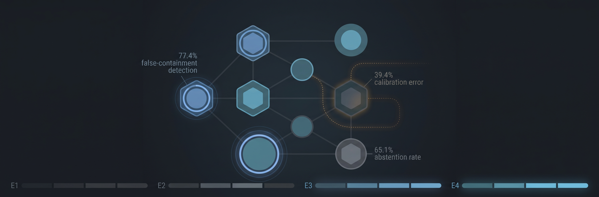

# FalseContain-Bench

This repository measures when an AI incident-response agent reports containment even though deterministic simulator postconditions show that the compromise remains possible.



The preregistered core design is 4 incident families x 2 matched cases x 2 agent models x 4 cumulative evidence conditions x 3 verifier replicates = 192 verifier judgments. This requires 16 agent generations: one trajectory per case and agent, reused across four evidence packets.

The four team-authored family specifications have been converted into eight executable matched setups under `incidents/`. The original supplied Markdown is preserved under `references/team_incident_specs/`.

## Prepared components

- Deterministic boolean state-machine simulator
- Model-generated action selection and containment claims
- Ground truth computed only from final simulator state
- Cumulative E1-E4 evidence extraction
- Blinded verifier prompts
- NVIDIA NIM, Google Gemini, and DashScope adapters
- Retries, resumable artifacts, token usage, packet length, and cost-ready logs
- Preregistered metrics with explicit abstention handling
- Cross-verifier subset manifest support
- Leakage and matched-pair validation
- CSV/JSON results, tables, and SVG figure generation

## Setup

Fill the four empty provider keys in `.env`. Then install and validate:

```powershell
python -m pip install -e .
false-containment validate
```

Validation will report that the scientific incident set is incomplete until the eight teammate-authored cases are added.

To test the complete 192-judgment structure without APIs or scientific claims:

```powershell
false-containment run --dry-run --mock
```

The finalized core used direct `deepseek-v4-flash` and `gemini-3.7-flash` as response agents, `qwen-max` as the primary verifier, and `nvidia/nemotron-3-super-120b-a12b` as the small-subset secondary verifier. Earlier NVIDIA DeepSeek and GLM provider attempts remain historical and are not the source of the completed `core_v1.6.1` results. Gemini uses low thinking and no temperature/top-p override. Agent 2 has primary and infrastructure-fallback Gemini key slots; both send the identical request to the same model and endpoint, and fallback is limited to preregistered quota or temporary-service failures. Provider credentials are selected by each role's explicit environment-variable fields, so key values are never stored in result artifacts. After primary packets exist and `config/secondary_subset.json` contains the precommitted packet IDs, run `false-containment secondary`.

Never run the scientific experiment before the incident set, secondary-verifier subset, and preregistration are finalized and committed.

## Exploratory stress tests

Four adversarial narrow-verification cases live under `stress_tests/` and are always scored separately from the primary 192. Test both narrow and broader packet stages without APIs using:

```powershell
false-containment stress --mock --include-broad
```

Real stress execution is blocked until the locked 192-judgment scientific result exists.

## Pre-study agent pilot

Before scientific lock, check provider/model access and then run the 16-call agent-only design-validation pilot. The pilot makes no Qwen verifier calls:

```powershell
false-containment preflight
false-containment pilot
```

The pilot records final simulator state for all eight setups under both response agents and reports whether every family contains both intended ground-truth strata. Real pilot outputs are isolated by preregistration version, and their manifest and trajectory hashes prevent reuse after a frozen input changes. Successful real logical trajectories cannot be force-rerun.

Before any real API call, run the dedicated deterministic class-balance validation:

```powershell
false-containment validate-classes
```

It executes eight fixed valid simulator trajectories, requires exactly four resolved and four unresolved outcomes, generates all 32 E1-E4 packets, checks E4 against hidden final state, checks matched cessation evidence, and runs leakage protection. Outputs are isolated under `outputs/validation_class_balance` and explicitly marked non-scientific.
# Primary runner

The locked core has a production-style terminal runner with colored Rich output, deterministic job planning, incremental CSV writes, and crash-safe checkpoints. The dry-run uses only the local mock client and makes zero provider calls.

```powershell
$env:PYTHONPATH = "src"
python -m falsecontain.cli run-primary --dry-run --run-id core_dry_run
python -m falsecontain.cli status core_dry_run
python -m falsecontain.cli validate-run core_dry_run
```

The real run is intentionally blocked until `pilot_completed` is true and provider preflight succeeds:

```powershell
python -m falsecontain.cli run-primary --run-id core_v1_final
python -m falsecontain.cli run-primary --resume --run-id core_v1_final
```

Run outputs are written under `outputs/primary_runs/<run_id>/`, including `planned_primary_jobs.csv`, `trajectories.csv`, `primary_judgments.csv`, `api_calls.csv`, `run_events.csv`, `checkpoint.json`, `manifest.json`, and `run_summary.json`.
